# Internee.pk-AI-Powered-Resume-Builder-UI
Complete UI/UX design for the AI Resume Builder including main pages, components, variants, assets, and overlays.

---

## AI Resume Landing Page
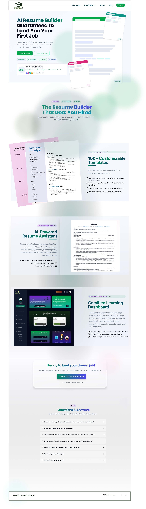

---

## Choose Resume Template Page
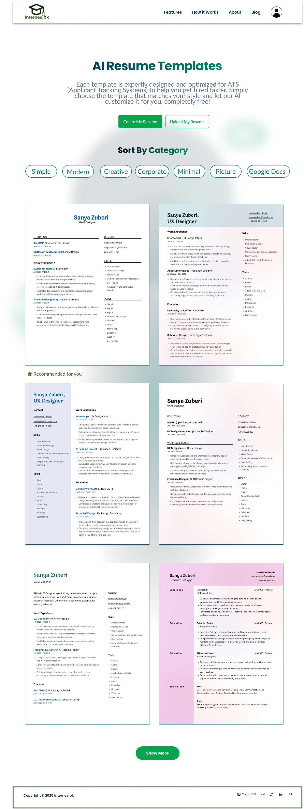

---

## Resume Builder Page
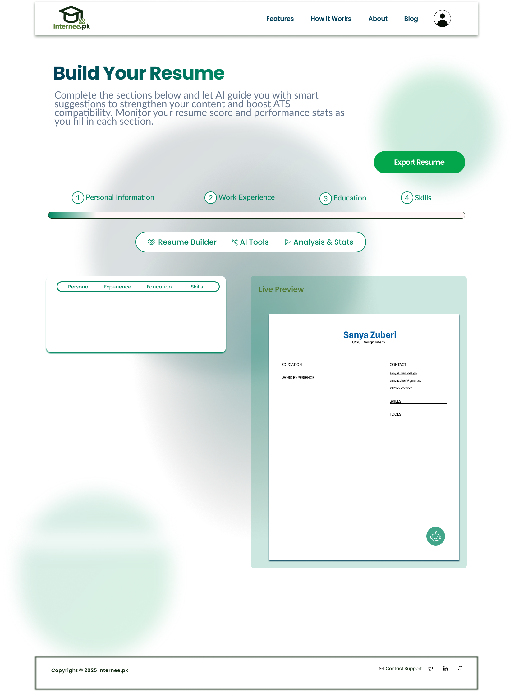

---

## Gamified Learning Dashboard
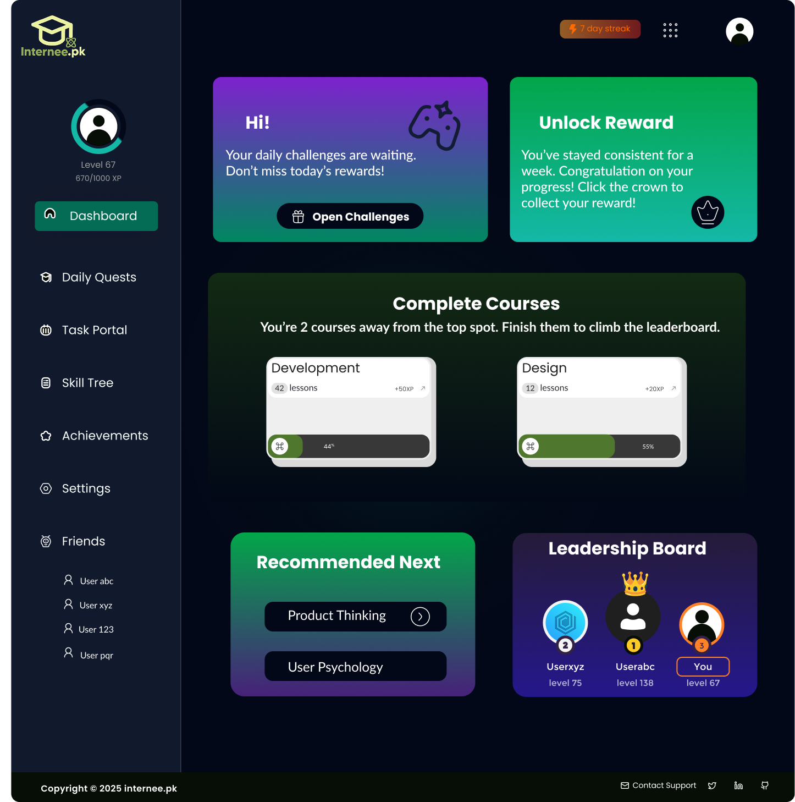

---

## Daily Challenges Page
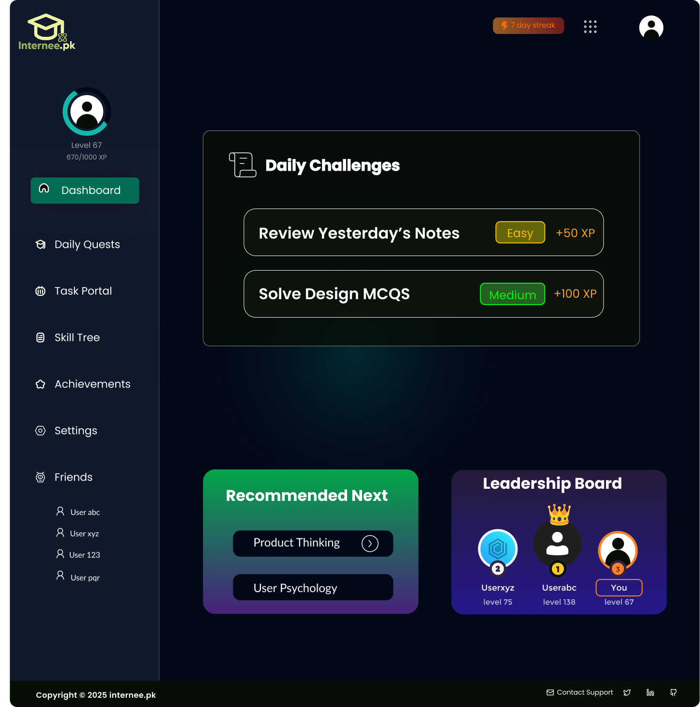

---

## Components & Variants
Reusable UI components built with Auto Layout and structured variants for scalability and consistency.

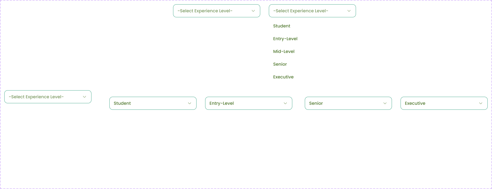
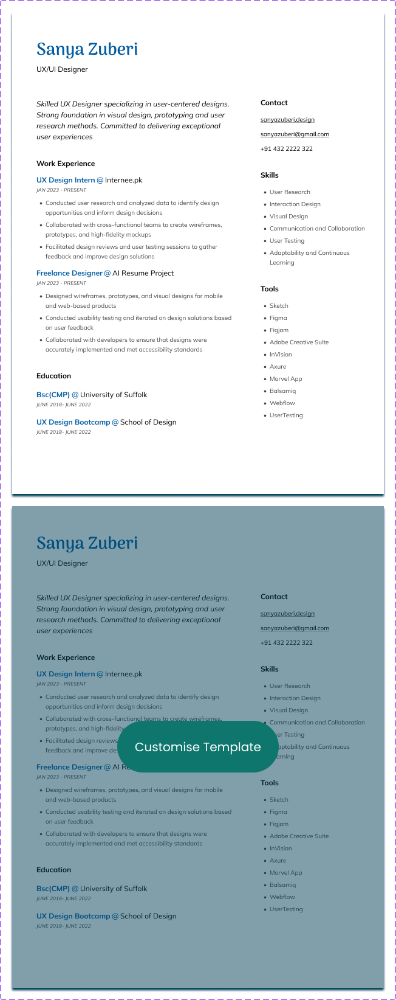
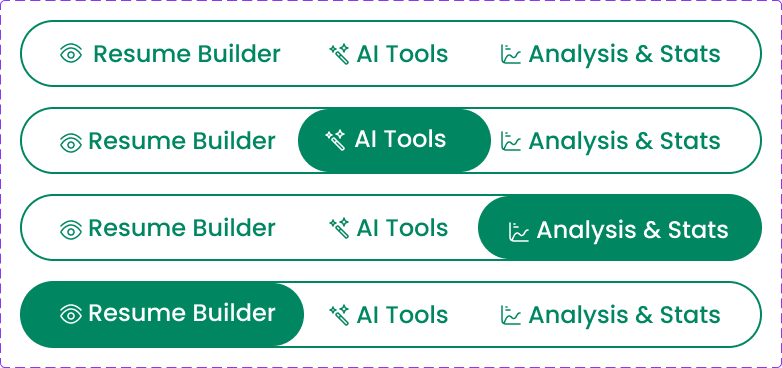
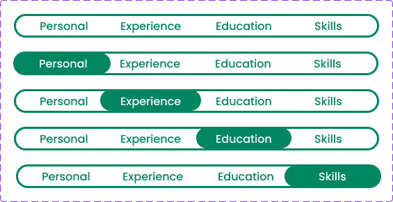
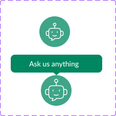

---

## Overlays
Interactive overlays including modals, dropdowns, popups, and system states used in the prototype flow.

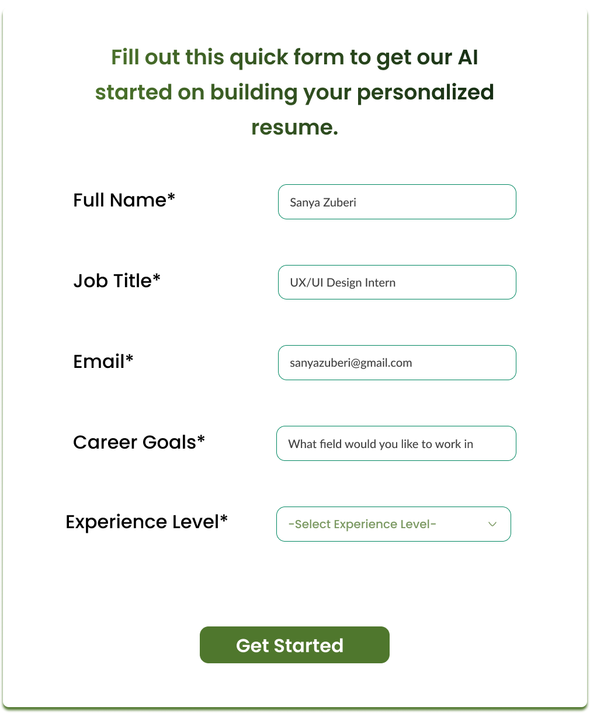
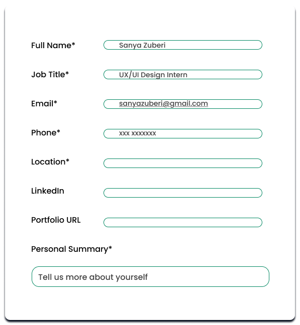

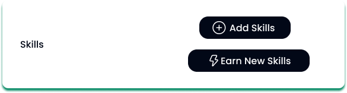
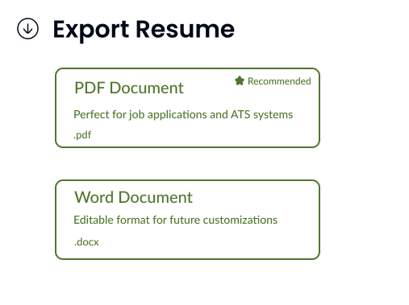

---

[View full Figma File](https://www.figma.com/proto/ZQqdYVwnsTjYiJbNyptFZK/Internee.pk-AI-Powered-Resume-Builder-UI?node-id=2-3&t=OTVDh4Kd8tFo2b95-1) 

